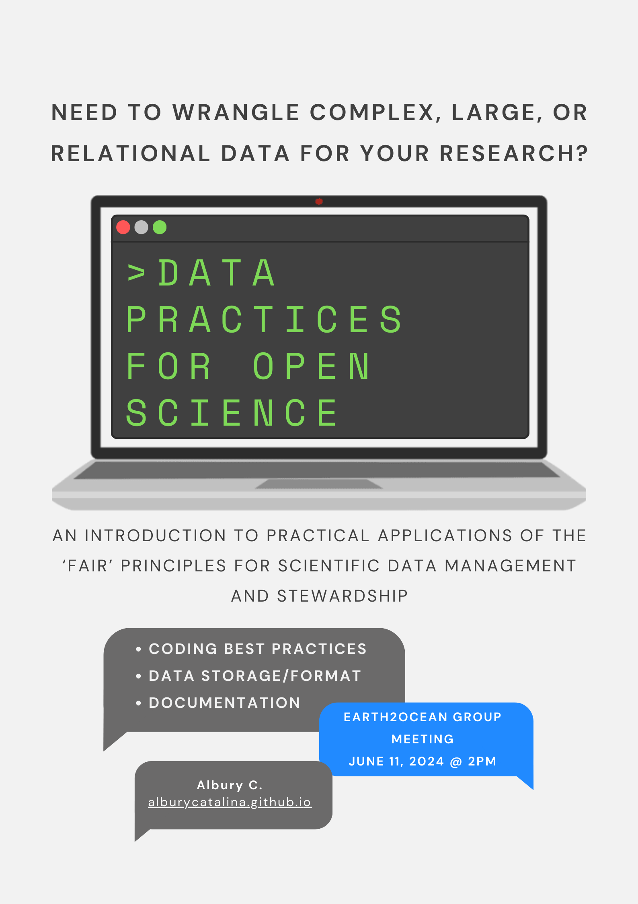

# data-practices

Materials for a talk to the [Earth to Ocean research group](https://earthtooceansfu.ca/) at Simon Fraser University, titled "Data Practices for Open Science". This presentation serves as an introduction to practical applications of the "FAIR" method for scientific data management and stewardship.

